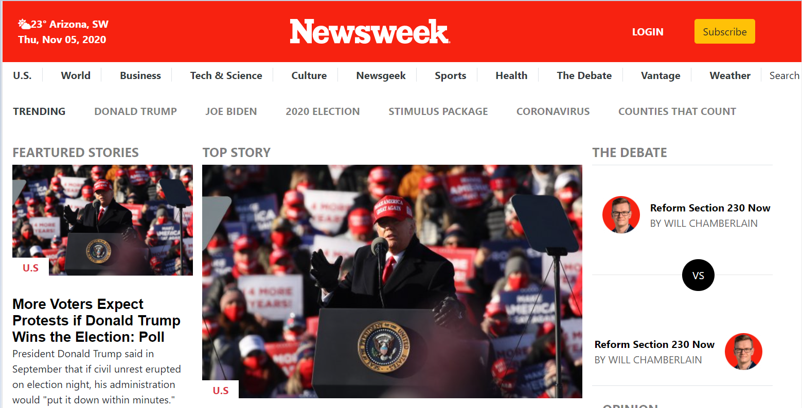

## Week 3

# Project 3 :  Building with Bootstrap Framework

> This Project consists of making a clone of a newsweek page using Bootstrap framework and CSS preprocessors.

You can find the original project specification at: https://www.theodinproject.com/courses/html5-and-css3/lessons/using-bootstrap

## Built With

- HTML5
- CSS3 & SASS
- Bootstrap 4

## Live Demo 

[Live Demo Link](https://od-c0d3r.github.io/newsweek-clone/)

## Authors

👤 **Nihal Mohammad**

- GitHub: [@apricot12](https://github.com/apricot12)
- LinkedIn: [@aprikot-web](https://www.linkedin.com/in/aprikot-web/)

👤 **Omar Rashad**

- GitHub: [@od-c0d3r](https://github.com/od-c0d3r)
-LinkedIn: [@omarrashad](https://www.linkedin.com/in/omarrashad)

## 🤝 Contributing

Contributions, issues, and feature requests are welcome!

## Show your support

Give a ⭐️ if you like this project!

